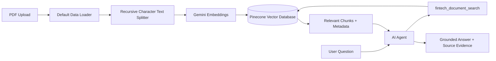

# FinTech Document Intelligence & Risk Assistant

A document-grounded RAG assistant for retrieving and explaining information from FinTech, financial, risk, and regulatory documents.

## Project Overview

This project extends a basic PDF RAG workflow into a persistent, multi-document document-intelligence system.

The current implementation uses:

- **n8n** — workflow orchestration
- **Pinecone** — persistent vector database
- **Google Gemini `gemini-embedding-001`** — document/query embeddings
- **OpenAI chat model** — response generation through the n8n AI Agent
- **PDF Data Loader + Recursive Character Text Splitter** — document ingestion
- **Metadata** — document identity, version, source, and upload timestamp

## Problem

Financial and regulatory documents can be long and difficult to search manually. A general-purpose LLM can also answer from prior knowledge instead of the document being analyzed.

The goal is to build an assistant that:

1. Retrieves relevant document context before answering.
2. Grounds answers in uploaded documents.
3. Distinguishes between multiple documents.
4. Reports source metadata and evidence locations.
5. Refuses to invent information that is not present in the knowledge base.

## Architecture



## Ingestion Pipeline

```text
PDF Upload
    ↓
Default Data Loader
    ↓
Recursive Character Text Splitter
    ↓
Gemini Embeddings
    ↓
Pinecone
```

The current metadata schema is:

```text
document_id
document_name
document_type
version
source
upload_date
```

Pinecone also stores extracted PDF metadata such as chunk line locations and PDF information when available.

## Retrieval Pipeline

```text
User Question
    ↓
AI Agent
    ↓
fintech_document_search
    ↓
Semantic Search in Pinecone
    ↓
Relevant Chunks + Metadata
    ↓
AI Agent
    ↓
Grounded Response
```

The AI Agent is instructed to search the document knowledge base before answering document-related questions and not to use unsupported prior knowledge.

## Current Knowledge Base Test Documents

The evaluation used two uploaded documents:

1. `Module 2 Deterministic model[1].pdf`
   - Quantitative modeling
   - Deterministic models
   - Growth/decay
   - Present/future value
   - Classical optimization

2. `GUIDELINESDIGITALLENDINGD5C35A71D8124A0E92AEB940A7D25BB3.pdf`
   - RBI digital lending guidelines
   - Key Fact Statement
   - Cooling-off/look-up period
   - LSP requirements
   - Data and privacy requirements
   - Grievance redressal

## Evaluation

An initial 10-question evaluation set was run covering:

- RBI document retrieval
- Quantitative-modeling document retrieval
- Multi-document questions
- Metadata/source grounding
- Out-of-scope questions

### Result

**10/10 tests passed — 100% functional pass rate on the initial evaluation set.**

This is a functional test result, not a claim of 100% general RAG accuracy.

See [`RAG_EVALUATION.md`](RAG_EVALUATION.md).

## Example

### Question

> According to the RBI Digital Lending document, what is the cooling-off period?

### System behavior

The assistant retrieved the RBI document and returned:

- Document name
- Version
- Relevant topic
- Evidence location

For an unsupported question such as:

> What is India's current repo rate?

the assistant returned:

> I could not find this information in the uploaded documents.

This demonstrates the intended grounded-answer behavior.

## Key Engineering Features

### Persistent vector storage

The original class workflow used a Simple Vector Store. This implementation uses Pinecone so document vectors persist independently of a temporary in-memory workflow state.

### Multi-document retrieval

The knowledge base can contain multiple uploaded documents and retrieve relevant chunks from the appropriate source.

### Metadata

Each document is tagged with identity and provenance metadata:

```text
document_id
document_name
version
document_type
source
upload_date
```

### Source-aware responses

The AI Agent reports source information when available and avoids inventing page numbers, section names, document names, or versions.

### Out-of-scope handling

If the retrieved documents do not contain enough information, the assistant explicitly states that the information was not found instead of answering from general knowledge.

## Limitations

This is a portfolio/demo implementation, not a production compliance system.

Current limitations include:

- The evaluation set contains only 10 manually designed questions.
- Retrieval precision/recall has not been formally benchmarked.
- Access control and per-user namespaces are not implemented.
- Automated ingestion deduplication is not implemented.
- Document update/deletion lifecycle is not fully automated.
- Dynamic metadata filtering has not yet been implemented as a separate retrieval-control layer.
- Version `1.0` is application metadata assigned during ingestion; it does not automatically infer the legal/version status of a document.

## Future Improvements

- Dynamic metadata filtering
- Per-user/per-organization namespaces
- Document lifecycle management
- Duplicate-ingestion protection
- Automated evaluation
- Retrieval precision/recall measurement
- Structured risk/compliance outputs
- Authentication and access control
- Monitoring and retrieval analytics
- Page-level citation mapping where reliable page metadata is available

## Project Structure

```text
FinTech_Document_Intelligence_RAG/
├── README.md
├── RAG_EVALUATION.md
├── RAG_EVALUATION.csv
├── ARCHITECTURE.md
├── Fintech_Document_Intelligence_Rag.json
└── architecture.mmd
```
- OpenAI API keys
- n8n credentials
- private documents that do not need to publish

